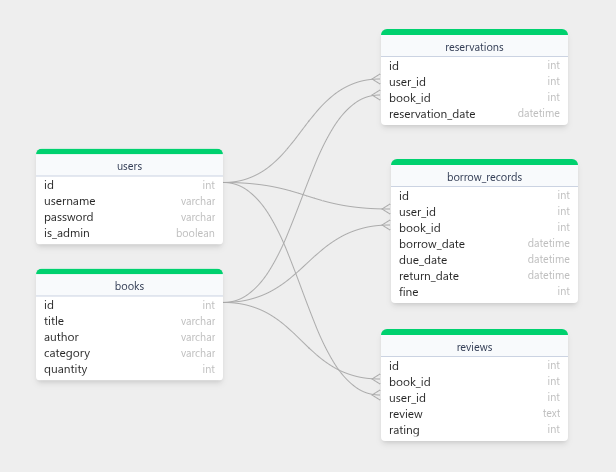

# 📚 Library Management System (Console-based | Python + MySQL)

A complete console-based **Library Management System** built using **Python**, with **MySQL** as the database. This project supports full **Admin and User functionality**, allowing book management, borrowing/returning, review and rating, and user management.

## 🛠 Technologies Used

- Python 3
- MySQL (with raw SQL queries)
- Object-Oriented Programming (OOP)
- Command-line interface

## 📂 Project Structure
```
library-management-system/
│
├── models/
│ ├── book.py 
| ├── database.py
| ├── insertData.py
│ ├── reservation.py
│ ├── reviewAndRating.py 
| ├── table.py
│ └── user.py 
├── .gitignore
├── README.md # Project documentation
├── ER_diagram.png # Entity-Relationship Diagram
├── main.py # Entry point
├── requirements.txt # Python dependencies
```

---

## Features

### User Features
- **User Registration and Login**  
  Users can create accounts and securely log in.

- **Browse Books**  
  View all books or search books by title, author, or category.

- **Borrow Books**  
  Borrow available books for a fixed period (default 14 days).

- **Return Books**  
  Return borrowed books and automatically calculate late fines.

- **Reserve Books**  
  Reserve books when no copies are currently available.

- **View Borrow History and Fines**  
  Check past borrowing records and any fines incurred for late returns.

- **Add Reviews and Ratings**  
  Write reviews and rate books (1 to 5 stars).

- **Update Password**  
  Change account password securely.

---

### Admin Features
- **Manage Books**  
  Add, update (including quantity), and delete books.

- **Manage Users**  
  Add new users, view all users, search users by ID, and delete users.

- **View and Cancel Reservations**  
  See all reservations and cancel them if needed.

---

## Technical Details

- **Backend:** Python 3  
- **Database:** MySQL  
- **Database Access:** Raw SQL queries 
- **OOP:** Object-Oriented Programming principles used
- **Password Handling:** Secure password hashing  
- **Fine Calculation:** Automatically calculated based on return date  
- **Reservation Queue:** First-come, first-served reservation system  

---
### 📊 ER diagram


---
### 🔧 Setup Instructions
Prerequisites:
- Python 3.x
- MySQL Server
- mysql-connector-python module

### Clone the Repository
```
git clone https://github.com/saminmahmud/Library-Management-System.git
cd Library-Management-System
```

### Create virtual environment and activate it:
```
python -m venv env
source env/bin/activate  # Linux/macOS
env\Scripts\activate     # Windows
```

### Install Dependencies
```
pip install -r requirements.txt
```

### Configure the Database
1. Create the MySQL database
2. Edit your database.py file with your database credentials:
```
self.connection = mysql.connector.connect(
    host="localhost",
    port=3306,  # Default MySQL port or your custom port
    user="your_mysql_user",
    password="your_mysql_password",
)
```

### Run the Project
```
python main.py
```
