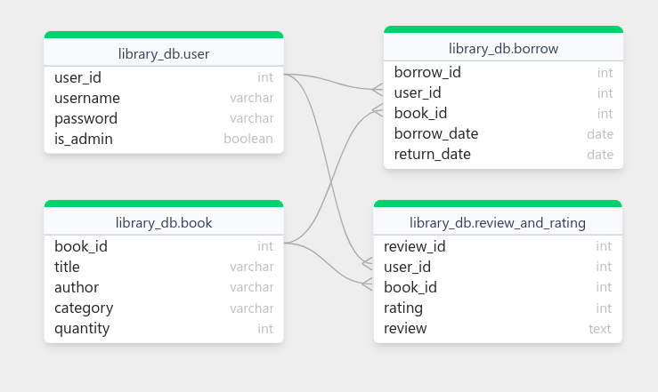

# 📚 Library Management System (Console-based | Python + MySQL)

A complete console-based **Library Management System** built using **Python**, with **MySQL** as the database. This project supports full **Admin and User functionality**, allowing book management, borrowing/returning, review and rating, and user management.

## 🛠 Technologies Used

- Python 3
- MySQL (with raw SQL queries)
- Object-Oriented Programming (OOP)
- Command-line interface

## 📂 Project Structure
```
library-management-system/
│
├── main.py # Entry point
├── models/
│ ├── book.py 
│ ├── user.py 
│ ├── reviewAndRating.py 
| ├── table.py
│ └── database.py
├── README.md # Project documentation
├── image.png
├── .gitignore
```


## ✅ Features

### 👤 User Functionality
- User login
- View all books
- View book details with reviews & ratings
- Search books by title, author, or category
- Add reviews and ratings
- Borrow and return books
- View personal borrow history
- Update own password

### 👑 Admin Functionality
- All user features, plus:
- Search users by ID
- Add, update, and delete books
- Update book quantity
- Add new users
- View all users
- Delete users


### 📊 ER diagram


### 🔧 Setup Instructions
Prerequisites:
- Python 3.x
- MySQL Server
- mysql-connector-python module

### Clone the Repository
```
git clone https://github.com/saminmahmud/Library-Management-System.git
cd Library-Management-System
```

### Install Dependencies
```
pip install mysql-connector-python
```

### Configure the Database
1. Create the MySQL database
2. Edit your database.py with your database credentials:
```
self.connection = mysql.connector.connect(
    host="localhost",
    user="your_mysql_user",
    password="your_mysql_password",
    database="your_database_name"
)
```

### Run the Project
```
python main.py
```
